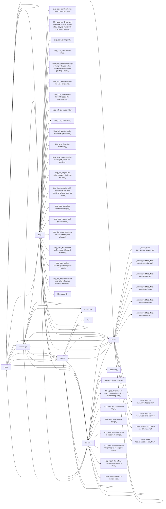

# Site Flow — bradfrost.com

Captured 14 states across 7 pages on 2026-04-07.

## Pages

| Route | Screenshot | Links To |
|---|---|---|
| / |  | /, /workshops, /blog, /contact, /speaking, /music |
| / |  | /, /workshops, /blog, /contact, /speaking, /music |
| /workshops |  | /, /workshops, /blog, /contact, /workshops/, /speaking, /music |
| /blog |  | /, /workshops, /blog, /contact, /blog/post/storybook-mcp-with-dominic-nguyen/, /blog/post/my-8-year-old-vibe-coded-a-video-game-about-playing-music-with-michael-mcdonald/, /blog/post/coding-club/, /blog/post/the-creative-infinite/, /blog/post/i-redesigned-my-website-without-touching-my-keyboard-all-while-painting-a-mural/, /blog/link/fine-specimens-by-elliot-jay-stocks/, /blog/post/a-designers-thoughts-about-this-moment-in-ai/, /blog/link/old-music-friday/, /blog/post/real-time-ui/, /blog/link/ghostwriter-by-rjd2-drum-synth-cover/, /blog/post/fostering-community/, /blog/post/announcing-live-ai-design-systems-jam-sessions/, /blog/link/angine-de-poitrine-mata-zyklek-live-on-kexp/, /blog/link/designing-a-life-that-excites-you-with-christine-vallaure-wake-up-excited/, /blog/post/declaring-systems-bankruptcy/, /blog/post/nuance-and-garage-doors/, /blog/link/video-brad-frost-we-are-here-beyond-tellerrand/, /blog/post/we-are-here-performance-at-beyond-tellerrand/, /blog/post/im-live-streaming-a-redesign-of-my-website/, /blog/link/they-have-to-be-able-to-talk-about-us-without-us-anil-dash/, /blog/page/2/, /speaking, /music |
| /contact |  | /, /workshops, /blog, /contact, /speaking, /workshops/, /faq, /music |
| /speaking |  | /, /workshops, /blog, /contact, /speaking/, /speaking/frontendconf.ch, /blog/post/lets-make-a-design-system-live-coding-at-smashing-conf/, /blog/post/responsive-field-day-2/, /blog/post/atomic-web-design/, /blog/post/death-to-bullshit-at-creative-mornings/, /blog/post/beyond-squishy-the-principles-of-adaptive-design/, /blog/mobile/for-a-future-friendly-web-mobilism-2012/, /blog/web/for-a-future-friendly-web/, /speaking, /music |
| /music |  | /, /workshops, /blog, /contact, /_music/frost-frost/bassss_novox.mp3, /_music/frost-frost/frost-frost-in-my-veins.mp3, /_music/frost-frost/frost-frost-40000.mp3, /_music/frost-frost/frost-frost-idea-13.mp3, /_music/frost-frost/frost-frost-idea-27.mp3, /_music/frost-frost/frost-frost-idea-8.mp3, /_music/dangus-kahn/okrachoclea.mp3, /_music/dangus-kahn/super-octavius.mp3, /_music/brad-frost/honesty-unsettlement.mp3, /_music/brad-frost/cloud9dividedby3.mp3, /speaking, /music |

## Mobile Views

### homepage-mobile

### homepage-mobile

### workshops-mobile

### blog-mobile

### contact-mobile

### speaking-mobile

### music-mobile

## Menus

## Modals

## Expanded States

## Navigation Flow

