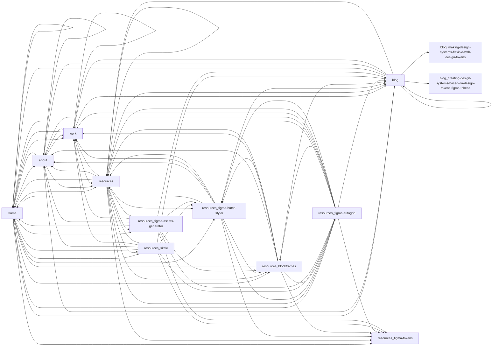

# Site Flow — jansix.at

Captured 22 states across 11 pages on 2026-04-07.

## Pages

| Route | Screenshot | Links To |
|---|---|---|
| / |  | /, /about, /work, /resources, /blog, /resources/figma-tokens, /resources/figma-batch-styler, /resources/figma-autogrid, /resources/skale, /resources/figma-assets-generator, /resources/blockframes |
| / |  | /, /about, /work, /resources, /blog, /resources/figma-tokens, /resources/figma-batch-styler, /resources/figma-autogrid, /resources/skale, /resources/figma-assets-generator, /resources/blockframes |
| /about |  | /, /about, /work, /resources, /blog |
| /work |  | /, /about, /work, /resources, /blog |
| /resources |  | /, /about, /work, /resources, /blog, /resources/figma-tokens, /resources/figma-batch-styler, /resources/figma-autogrid, /resources/skale, /resources/figma-assets-generator, /resources/blockframes |
| /blog |  | /, /about, /work, /resources, /blog, /blog/making-design-systems-flexible-with-design-tokens, /blog/creating-design-systems-based-on-design-tokens-figma-tokens |
| /resources/figma-batch-styler |  | /, /about, /work, /resources, /blog, /resources/blockframes, /resources/figma-tokens, /resources/figma-autogrid |
| /resources/blockframes |  | /, /about, /work, /resources, /blog, /resources/figma-tokens, /resources/figma-batch-styler, /resources/figma-autogrid |
| /resources/figma-autogrid |  | /, /about, /work, /resources, /blog, /resources/blockframes, /resources/figma-tokens, /resources/figma-batch-styler |
| /resources/skale |  | /, /about, /work, /resources, /blog, /resources/figma-batch-styler, /resources/figma-autogrid, /resources/figma-tokens |
| /resources/figma-assets-generator |  | /, /about, /work, /resources, /blog, /resources/blockframes, /resources/figma-tokens, /resources/figma-autogrid, /resources/figma-batch-styler |

## Mobile Views

### homepage-mobile

### homepage-mobile

### about-mobile

### work-mobile

### resources-mobile

### blog-mobile

### resources-figma-batch-styler-mobile

### resources-blockframes-mobile

### resources-figma-autogrid-mobile

### resources-skale-mobile

### resources-figma-assets-generator-mobile

## Menus

## Modals

## Expanded States

## Navigation Flow

