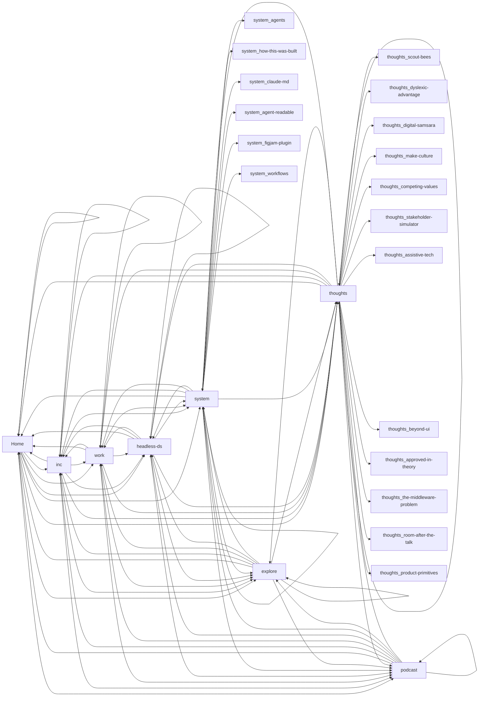

# Site Flow — lincolnmitchell

Captured 27 states across 9 pages on 2026-04-07.

## Pages

| Route | Screenshot | Links To |
|---|---|---|
| / |  | /, /inc, /work, /headless-ds, /system, /explore, /thoughts, /podcast |
| / |  | /, /inc, /work, /headless-ds, /system, /explore, /thoughts, /podcast |
| /inc |  | /, /inc, /work, /headless-ds, /system, /explore, /thoughts, /podcast |
| /work |  | /, /work, /inc, /headless-ds, /system, /explore, /thoughts, /podcast |
| /headless-ds |  | /, /headless-ds, /inc, /work, /system, /explore, /thoughts, /podcast |
| /system |  | /, /system, /inc, /work, /headless-ds, /explore, /thoughts, /podcast, /system/agents, /system/how-this-was-built, /system/claude-md, /system/agent-readable, /system/figjam-plugin, /system/workflows |
| /explore |  | /, /explore, /inc, /work, /headless-ds, /system, /thoughts, /podcast |
| /thoughts |  | /thoughts, /thoughts/scout-bees, /thoughts/dyslexic-advantage, /thoughts/digital-samsara, /thoughts/make-culture, /thoughts/competing-values, /thoughts/stakeholder-simulator, /thoughts/assistive-tech, /thoughts/beyond-ui, /thoughts/approved-in-theory, /thoughts/the-middleware-problem, /thoughts/room-after-the-talk, /thoughts/product-primitives, /, /inc, /work, /headless-ds, /system, /explore, /podcast |
| /podcast |  | /, /podcast, /inc, /work, /headless-ds, /system, /explore, /thoughts |

## Mobile Views

### homepage-mobile

### homepage-mobile

### inc-mobile

### work-mobile

### headless-ds-mobile

### system-mobile

### explore-mobile

### thoughts-mobile

### podcast-mobile

## Menus

### homepage-mobile-menu

### homepage-mobile-menu

### inc-mobile-menu

### work-mobile-menu

### headless-ds-mobile-menu

### system-mobile-menu

### explore-mobile-menu

### thoughts-mobile-menu

### podcast-mobile-menu

## Modals

## Expanded States

## Navigation Flow

